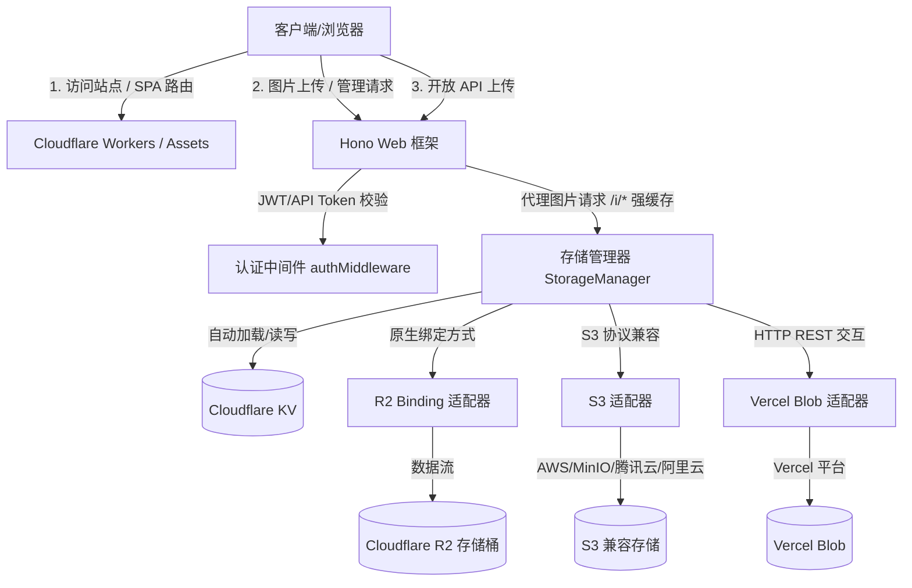

# 默默图床 (MomoImage) 📸

默默图床是一个专为 Cloudflare 平台（同时支持 Vercel）设计的高性能、现代化全栈图片托管系统。它采用极速轻量的 Fullstack（全栈）架构，提供开箱即用的高性能图片代理、多存储后端动态管理以及完备的安全认证。

> [!TIP]
> 默默图床通过将前端 SPA 静态资源与 Hono 后端 API 融为一体，并借助 Cloudflare R2 与 KV 提供了近乎零延迟、无限容量且极其廉价的图床方案。

---

## 🎨 架构设计

默默图床的系统架构如下所示：



---

## 🚀 核心特性

### 1. ⚡ 极速全栈架构
* **前端**：基于 **React 19** + **Vite 6** + **TypeScript** 驱动，采用精心设计的 CSS 提供沉浸式的高级深色/浅色交互体验。
* **后端**：基于 **Hono 4** 框架，部署于 **Cloudflare Workers** (支持 Wrangler Assets 静态资源挂载)。具备冷启动接近 0ms 的超凡响应速度。

### 2. 💾 统一的多存储后端适配 (Multi-Adapter Storage)
默默图床通过统一的 `StorageAdapter` 接口，支持多种主流对象存储，可在后台动态增加、删除、测试连接和一键设置默认值：
* **本地 R2 存储 (`r2-binding`)**：直接绑定本账号下的 Cloudflare R2 存储桶，速度最快、零延迟、零额外认证，是默认首选。
* **S3 兼容存储 (`s3`)**：支持通过 S3 协议访问任何 S3 兼容的对象存储（例如外部 Cloudflare R2 账号、AWS S3、MinIO 等），支持配置自定义 CDN 加速域名 (`publicUrl`)。
* **Vercel Blob 存储 (`vercel-blob`)**：针对 Vercel 部署环境深度优化，使用纯 HTTP REST 方式交互（不引入官方 SDK），包体积更轻量。

### 3. 🛡️ 双重认证安全体系
* **管理后台 JWT 认证**：后台登录生成 JWT 会话 Token，支持设置 `ADMIN_PASSWORD` 与 `JWT_SECRET`。若没有配置 `JWT_SECRET`，系统将自动生成强随机密钥并安全持久化到 Cloudflare KV。
* **开放 API Token 认证**：在管理端可生成与管理多个具有独立名称备注的 API 密钥，可实现程序化（如 ShareX、PicGo 等客户端）图片上传。客户端上传时，通过在 Header 携带 `Authorization: Token <api-token>` 即可进行安全调用。

### 4. 🔀 SPA 静态路由与本域图片强缓存代理
* **智能 SPA 回退代理**：Hono 路由通过 `c.env.ASSETS` 拦截所有未知静态资产，如果在 API 与图片访问路由之外遇到 404，会自动重定向回 `/index.html` 触发前端 SPA 路由，保证单页应用路由跳转体验。
* **1 年有效期强缓存**：图片统一通过图床本域 `/i/*` 进行本域代理访问。接口会自动从实际物理存储端拉取图片流并以强缓存头（`Cache-Control: public, max-age=31536000, immutable`）响应浏览器，极大节约对象存储下行流量及网络开销。

### 5. ✨ 人性化的前端交互与引导
* **多功能上传区**：支持多图并行上传、**拖拽上传**、**剪切板粘贴上传**，带有独立的上传进度条、成功打勾与失败报错提示。
* **快捷链接分享**：图片上传成功或点击图库复制时，提供弹窗一键复制 **Direct URL**、**Markdown**、**HTML**、**BBCode** 各种图片引用格式。
* **初始化引导与检测**：
  * **零配置引导页**：若未在 Cloudflare 环境变量中配置 `ADMIN_PASSWORD`，系统亦能正常运行并渲染一个美轮美奂的「初始化引导步骤」页面，引导开发者去 Cloudflare 控制台添加变量。
  * **自定义域名检测**：若图床运行在 Workers 默认的 `*.workers.dev` 或 `*.pages.dev` 下，首页会自动展示 Banner 友好提醒，建议绑定自定义域名以保障访问速度与规避防跨域限制。

---

## 🛠️ 技术栈

* **核心框架**：[Hono v4](https://hono.dev/)
* **前端开发**：[React 19](https://react.dev/) + [Vite v6](https://vite.dev/) + TypeScript
* **对象存储 SDK**：`@aws-sdk/client-s3` (动态按需导入，优化首包体积)
* **部署平台**：Cloudflare Workers / Assets
* **持久化存储**：Cloudflare KV (元数据及配置) + Cloudflare R2 (物理图片)

---

## ⚙️ 部署与配置指南

### 1. 准备 Cloudflare 资源

部署前需在 Cloudflare 控制台创建以下资源：
1. **R2 存储桶**：创建一个名为 `momoimage` 的 R2 存储桶。
2. **KV 命名空间**：创建一个 KV 命名空间（用于存储图床配置和图片索引）。

### 2. 本地配置文件修改

打开项目根目录下的 [wrangler.jsonc](file:///d:/0_Projects/9.Code/codeProjects/momoimage/wrangler.jsonc) 文件，修改对应的绑定：

```jsonc
{
  "name": "momoimage",
  "main": "./src/api/index.ts",
  "compatibility_date": "2025-04-01",
  "compatibility_flags": [
    "nodejs_compat"
  ],
  "assets": {
    "directory": "./dist"
  },
  "r2_buckets": [
    {
      "binding": "R2_BUCKET",
      "bucket_name": "momoimage" // 替换为你的 R2 存储桶名称
    }
  ],
  "kv_namespaces": [
    {
      "binding": "KV_META",
      "id": "你的KV命名空间ID" // 替换为你在 Cloudflare 创建的 KV ID
    }
  ],
  "vars": {
    "DEPLOY_TARGET": "cloudflare"
  }
}
```

### 3. 配置环境变量 (Variables)

> [!IMPORTANT]
> 敏感信息建议在 Cloudflare 控制台 -> 你的 Worker 实例 -> **设置 (Settings)** -> **变量和机密 (Variables)** 中进行配置。

系统需要或支持的变量如下：

| 变量名 | 类型 | 是否必填 | 说明 |
| :--- | :---: | :---: | :--- |
| `ADMIN_PASSWORD` | Secret | **是** | 管理员登录密码。未设置时，系统会自动呈现初始化配置页。 |
| `JWT_SECRET` | Secret | 否 | JWT 签名密钥（可由系统在 KV 中自动生成随机密钥，无需手动填）。 |
| `SITE_URL` | Variable | 否 | 站点的 URL 域名（例如 `https://img.example.com`），未设置时会自动根据用户请求 URL 拼接。 |

### 4. 构建与部署

项目提供了极简的一键部署指令：

```bash
# 1. 安装项目依赖
npm install

# 2. 本地开发预览
npm run dev

# 3. 编译前端静态资源，并将项目部署到 Cloudflare Worker (Wrangler Assets)
npm run deploy
```

---

## 📋 API 接口说明

系统内置了详尽的后端接口，认证机制支持 `Authorization: Bearer <jwt>` 与 `Authorization: Token <api-token>`。

### 🔓 公开接口 (无需认证)

#### 1. 系统信息获取
* **请求方式**：`GET`
* **路由**：`/api/info`
* **返回格式**：
  ```json
  {
    "success": true,
    "data": {
      "siteUrl": "https://img.example.com",
      "hasCustomDomain": true,
      "deployTarget": "cloudflare",
      "version": "1.0.0",
      "needSetup": false
    }
  }
  ```

#### 2. 图片访问 (直链)
* **请求方式**：`GET`
* **路由**：`/i/:key`
* **说明**：支持长达 1 年的浏览器强缓存，自动支持中文字符与子目录路径。

#### 3. 后台管理员登录
* **请求方式**：`POST`
* **路由**：`/api/auth/login`
* **参数**：`{ "password": "your_password" }`
* **返回**：`{ "success": true, "data": { "token": "JWT_TOKEN" } }`

---

### 🔒 受保护接口 (需要 Bearer/Token 认证)

所有受保护接口需要在 Header 中加入认证凭证：
* 管理员后台：`Authorization: Bearer <JWT_TOKEN>`
* 外部编程接口：`Authorization: Token <API_TOKEN>`

#### 1. 上传图片
* **请求方式**：`POST`
* **路由**：`/api/upload`
* **Query 参数**：`?storage=storage_id` (可选，不传则使用后台设置的默认存储后端)
* **Body 格式**：`multipart/form-data`
  * `file`: 图片文件 (支持 JPEG, PNG, WebP, GIF, SVG 等，最大 20MB)
* **响应结果**：
  ```json
  {
    "success": true,
    "data": {
      "id": "12位唯一短ID",
      "url": "https://img.example.com/i/2026/05/abc123_pic.png",
      "originalName": "pic.png",
      "size": 102400,
      "mimeType": "image/png",
      "links": {
        "url": "https://img.example.com/i/2026/05/abc123_pic.png",
        "markdown": "",
        "html": "",
        "bbcode": "[img]https://img.example.com/i/2026/05/abc123_pic.png[/img]"
      }
    }
  }
  ```

#### 2. 程序化上传脚本示例 (curl)
你可以配合 ShareX、PicGo 或本地 Shell 脚本，一键实现终端快速上传图片：

```bash
curl -X POST \
  -H "Authorization: Token your_api_token" \
  -F "file=@/path/to/your/image.png" \
  https://img.example.com/api/upload
```

#### 3. 图片库管理
* **获取图片列表 (分页)**：`GET /api/images?page=1&pageSize=20`
* **获取图片详情**：`GET /api/images/:id`
* **物理/元数据删除**：`DELETE /api/images/:id` (自动从对应的物理存储端进行真实删除，并同步清理 KV 元数据与全局索引)

#### 4. 外部存储后端管理
* **列出所有存储配置**：`GET /api/storage` (已自动对 `secretAccessKey` / `token` 等敏感参数进行掩码脱敏)
* **新增外部存储**：`POST /api/storage`
* **修改存储配置**：`PUT /api/storage/:id`
* **删除存储配置**：`DELETE /api/storage/:id`
* **测试连接性**：`POST /api/storage/:id/test` (通过列出一条测试文件来实时验证连接密钥和可用性)

#### 5. API 开放令牌管理
* **列出 API 令牌**：`GET /api/auth/tokens`
* **创建新 API 令牌**：`POST /api/auth/token` (Body: `{ "name": "备注名" }`)
* **注销 API 令牌**：`DELETE /api/auth/token/:id`

---

## 🔒 许可

基于 MIT 协议开源。你可以自由分发、修改和在闭源商业项目中使用。
